# Futstats 

<br>
O Futstats é uma plataforma web para consulta e análise de estatísticas e detalhes do mundo do futebol. Atravez da mesma podes aceder a
uma ampla e diversa consulta de dados no mundo do futebol – desde pontuações e resultados de campeonatos até o desempenho detalhado de equipes e jogadores favoritos.

## Índice
- [Introdução](#introdução)
- [Estrutura](#estrutura)
- [Instalação](#instalação)
- [Uso](#uso)
- [Galeria do Website](#galeria-do-Website)
- [Resumo Final](#resumo-final) 

## Introdução

O Futstats foi desenvolvido para os apaixonados por futebol que oferece uma variedade de funcionalidades, incluindo:
Acesso a informações detalhadas sobre :

            → Interface intuitiva e fácil de usar ✅
            → Consulta de todas as ligas do mundo 🌍
            → Detalhes sobre pontuações 🔢
            → Resultados do campeonato 🎯
            → Equipas 👥
            → Jogadores ⚽
            → Tabelas de classificação ⁉️
            E muito mais...

## Estrutura

O Futstats é uma aplicação que integra diversas tecnologias para oferecer uma
experiência completa aos usuários. O projeto é dividido em duas partes principais:

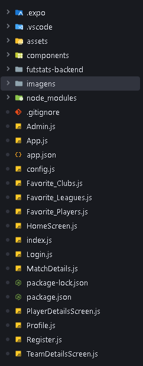

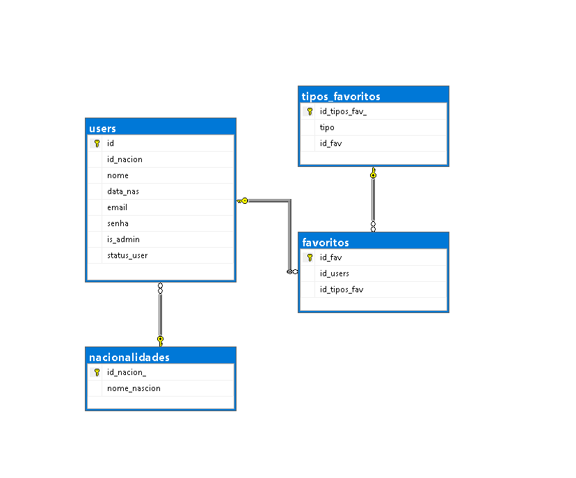

### Front-end

O front-end é responsável pela apresentação e interação com o usuário. Desenvolvido em **React Native**, ele é
composto por várias páginas e componentes, cada um com um objetivo específico. Exemplos de páginas incluem:

- Página de Navegação (`AppNavigator.js`)
- Página de Login (`Login.js`)
- Página de Registo (`Register.js`)
- Página de Equipas (`TeamDetailsScreen.js`)
- Página de Administrador (`Admin.js`)
- E muitas outras...

### Back-end

O back-end gerencia o processamento e armazenamento dos dados. Desenvolvido em **Node.js**, ele utiliza
uma base de dados em **SQL Server** e também faz requisições a uma API pública para obter dados do futebol. 
As rotas principais são:

- **Rota de Login:** `POST /login`
- **Rota de Registo:** `POST /register`
- **Rota de Equipas:** `GET /teams`
- **Rota de Jogadores:** `GET /players`
- **Rota de Ligas:** `GET /leagues`
- **Rota de Tabelas:** `GET /tables`
- **Rota de Resultados:** `GET /results`
- **Rota de Estatísticas:** `GET /statistics`


## Instalação

O Futstats já vem com todas as bibliotecas necessárias instaladas via npm na pasta [futstats-backend]. 
Para colocá-lo em funcionamento, basta configurar a base de dados utilizando o SQL Server, onde será
necessário configurar um Login com representado nas seguintes imagens.
(Nota: Se necessário segue um vídeo explicativo https://www.youtube.com/watch?v=UpZiamGmbTs)


Inicialmente, apos a instalação do SQL Server Management Studio, irá se deparar com a seguinte interface.

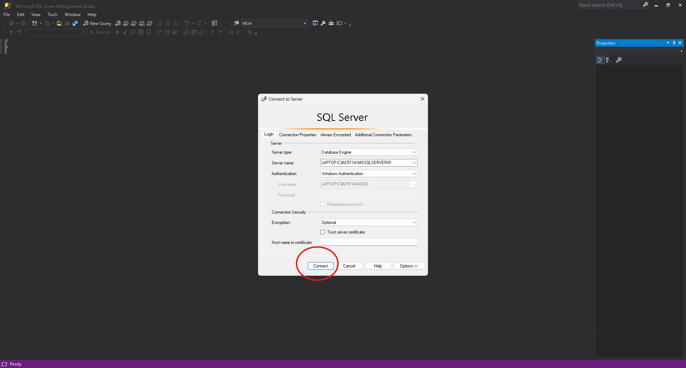

Onde bastará permir o botão escrito "Connect".

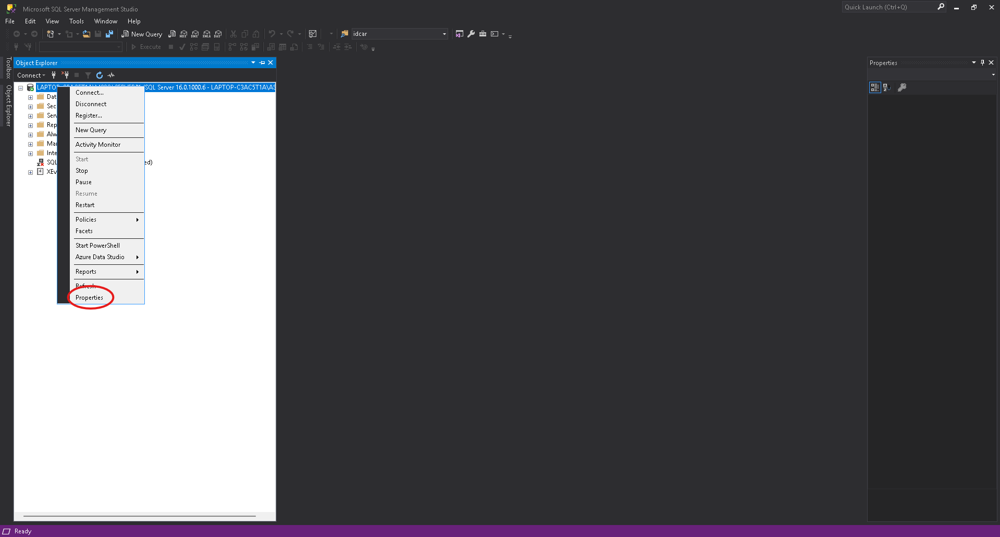

De seguida será necessário permir botão direito na sua máquina local e selecionar "Properties"

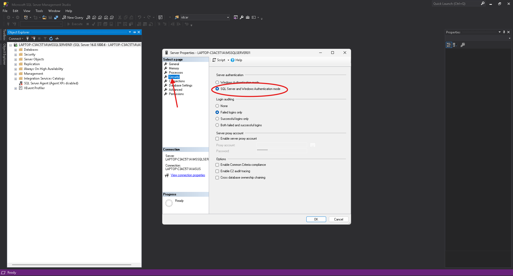

Quando for aberto este painel será necessario ir para a aba "Security" e selecionar a área circulada e clicar "OK".

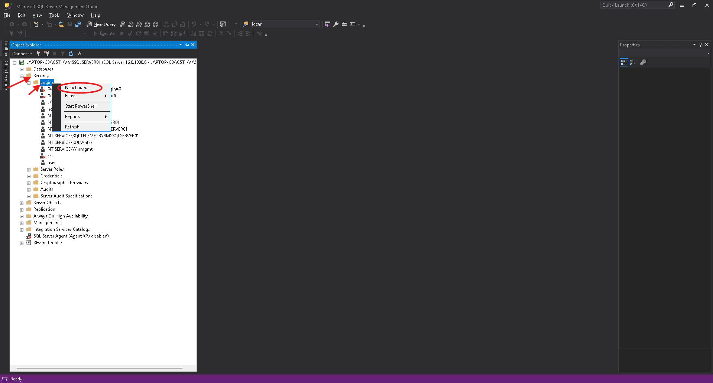

Opós estes passos, seguiremos para a aba "Security" e "Login" no menu lateral, e clicamos com o botão direito
no "Login", selecionado o "New Login". 

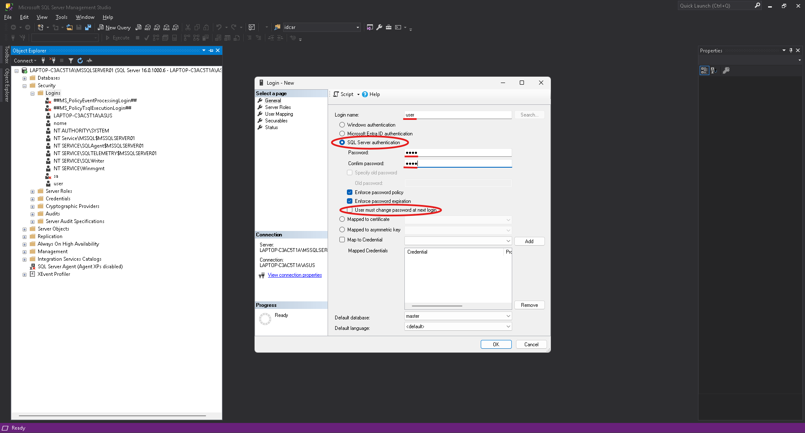

Quando for aberto este painel será necessario selécionar a oção do SQL Server authentication
e desmarcar a opção selécionada opor defauth.
(Nota: O servidor já vem com um user selécionado no código, para o correto funcionamento do mesmo, é
aconcelhado inserir as mesmas credenciais aqui inseridas.)


| Login Name | Password    |
|------------|-------------|
| user       | 1234        |


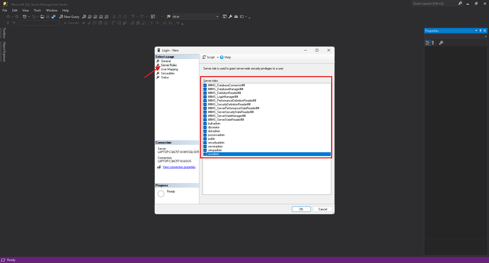

Para continuar, será necessário ir ate á aba "Server Roles" e selecionar todas as opções de permisões de acesso.


Agora basta desconectar do SQL e conectar nas respétivas "fichas com cruz e sem cruz".

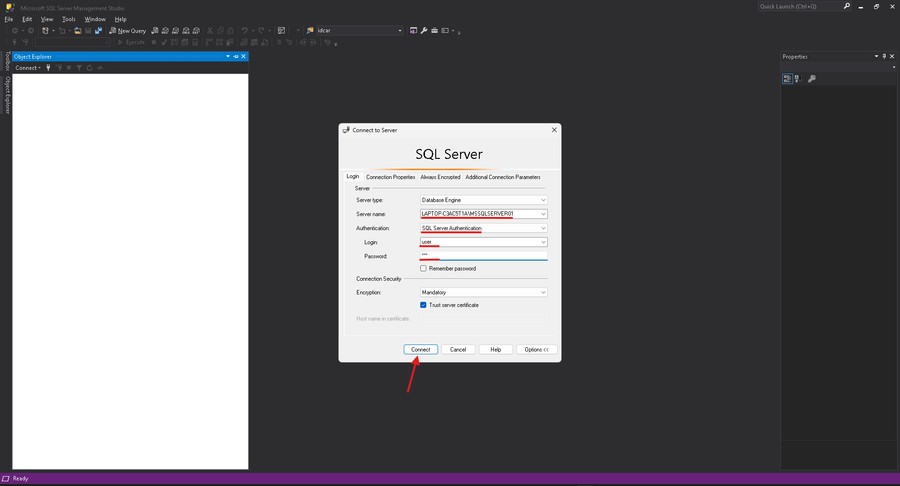

E conectar com as respetivas credências inseridas.
(Nota: Vale lembrar que é necessário copiar o "Server Name" para ser alterardo no código o nome da
máquina local que difere. E será necessário escolher a porta associada por defauth do seu computador, referente ao SQl)


Por último basta criar a base de dados com o seguinte comando:
```
CREATE DATABASE FutStats
```
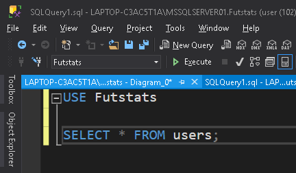

E executar o ficheiro SQL script que se encontra ./proj/FutStats/FutStats/database/script.sql

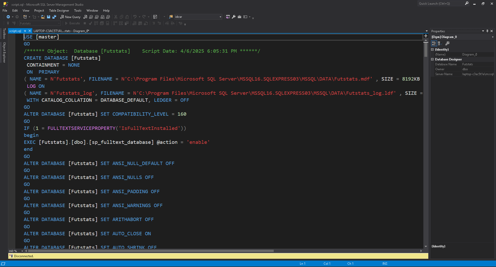

## Uso

Para utilizar o Futstats, basta  siga os passos:

### Iniciar o Front-end:

Executar o comando no terminal:
```
npm run web
```
### Iniciar o Back-end:

Abrir um segundo terminal e executar o comando:
```
cd futstats-backend
node server.js
```
### Link para o website:

Após isso, basta apenas abrir o browser e entrar no link:

```
http://localhost:8081/
```
### Login como Administrador para exploração total do website:

Para ter acesso a todas as funcionalidades do website, é necessário fazer login como administrador.
(Nota: Será tambem aconcelhado que crie algumas contas de utilizador,
 sendo assim possivel usufruir das funcionalidades de Admin.)
 
Para isso, basta utilizar as seguintes credenciais:

| Email                | Senha       |
|----------------------|-------------|
| admin@futstats.com   | Admin@1234  |

## Galeria do Website

### Página de Login


### Página de Registo


### Página de Administrador

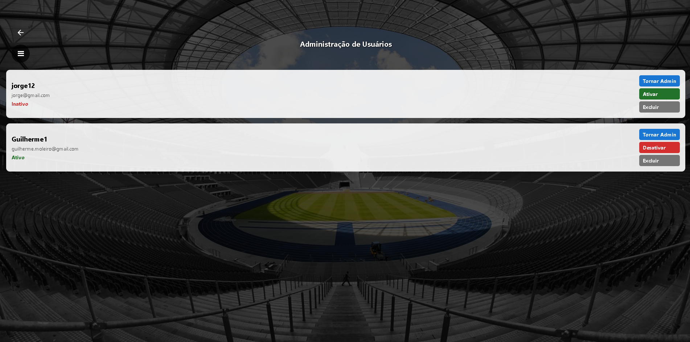

### Página de Equipas

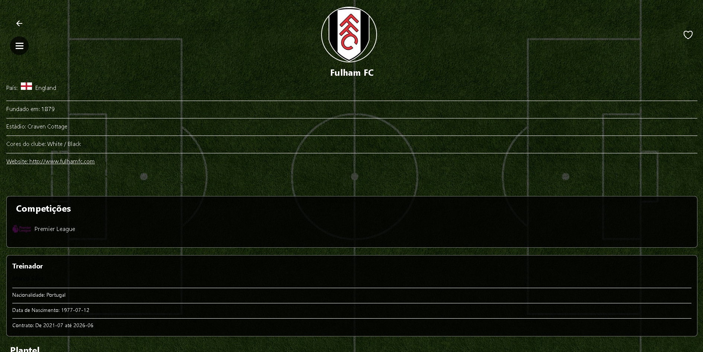

### Página de Jogadores

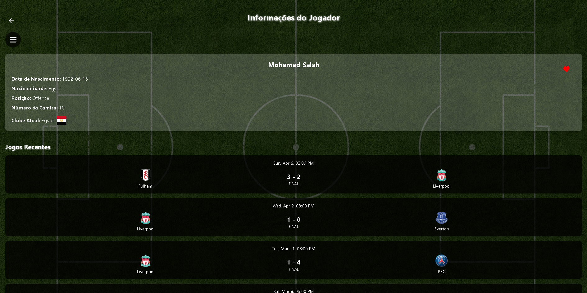


### Página de Tabelas

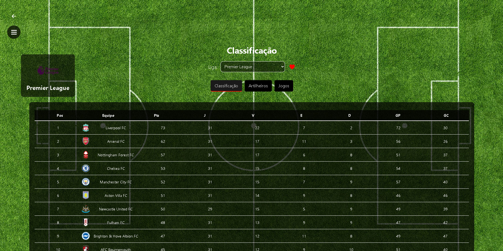

### Página do Perfil

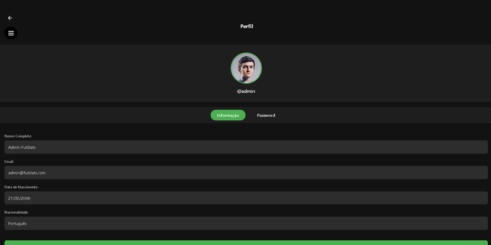

### Vídeo Final de Demonstração

[](https://youtu.be/Yak37LqXT-Q)

## Resumo Final

O Futstats transforma dados do futebol em informações valiosas para todo o tipo de adeptos desde analistas e
treinadores, a simples apixonados pelos seus clubes e jogadores.
Com uma interface amigável e recursos interativos, a plataforma facilita o acompanhamento de resultados e o
desempenho das suas equipas e jogadores favoritos. Explore, contribua e ajude-nos a tornar o Futstats ainda melhor!

Trabalho realizado por:
- [Jorge Castro] nº 210094
- [Guilherme Moleiro] nº 2024349


